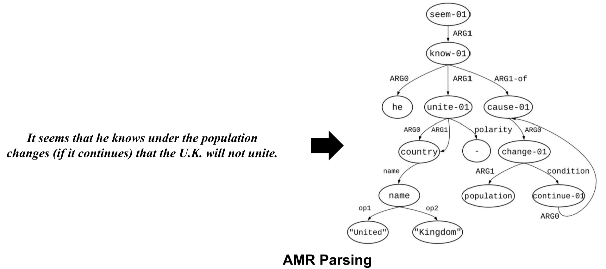

# AMR-Literature
This repo contains relevant resources related to AMR (Abstract Meaning Representation).

## AMR Parsing

{width=100px}

### Conference & Journal Paper
* A differentiable relaxation of graph segmentation and alignment for amr parsing. 
[[Paper]](https://arxiv.org/pdf/2010.12676.pdf)
[[Bib]]()
**EMNLP2021**
* Structure-aware Fine-tuning of Sequence-to-sequence Transformers for Transition-based AMR Parsing. 
[[Paper]]()
[[Code]]()
[[Bib]]()
**EMNLP2021**
* Stacked AMR Parsing with Silver Data. 
[[Paper]]()
[[Code]]()
[[Bib]]()
**Findings ACL2021**
* Ensembling Graph Predictions for AMR Parsing. 
[[Paper]]()
[[Code]]()
[[Bib]]()
**NeurIPS2021**
* AMR parsing with action-pointer transformer. 
[[Paper]]()
[[Code]]()
[[Bib]]()
**NAACL2021**
* One SPRING to Rule Them Both: Symmetric AMR Semantic Parsing and Generation without a Complex Pipeline. 
[[Paper]]()
[[Code]]()
[[Bib]]()
**AAAI2021
* Improving AMR Parsing with Sequence-to-Sequence Pre-training. 
[[Paper]]()
[[Code]]()
[[Bib]]()
**EMNLP2020**
* Fast semantic parsing with well-typedness guarantees. 
[[Paper]]()
[[Code]]()
[[Bib]]()
**EMNLP2020**
* Pushing the Limits of AMR Parsing with Self-Learning. 
[[Paper]]()
[[Code]]()
[[Bib]]()
**Findings EMNLP2020**
* Transition-based Parsing with Stack-Transformers. 
[[Paper]]()
[[Code]]()
[[Bib]]()
**Findings EMNLP2020**
* AMR Parsing via Graph-Sequence Iterative Inference. 
[[Paper]](https://arxiv.org/pdf/2010.12676.pdf)
[[Code]](https://github.com/jcyk/AMR-gs)
[[Bib]](https://aclanthology.org/2020.acl-main.119.bib)
**ACL2020**
* Core Semantic First: A Top-down Approach for AMR Parsing. 
[[Paper]]()
[[Code]]()
[[Bib]]()
**EMNLP2019**
* Broad-coverage semantic parsing as transduction.
[[Paper]]()
[[Code]]() 
[[Bib]]()
**EMNLP2019**
* AMR parsing as sequence-to-graph transduction. 
[[Paper]]()
[[Code]]()
[[Bib]]()
**ACL2019**
* Rewarding Smatch: Transition-based AMR parsing with reinforcement learning. 
[[Paper]]()
[[Code]]()
[[Bib]]()
**ACL2019**
* Better transition-based AMR parsing with a refined search space. 
[[Paper]]()
[[Code]]()
[[Bib]]()
**EMNLP2018**
* AMR parsing as graph prediction with latent alignment. 
[[Paper]]()
[[Code]]()
[[Bib]]()
**ACL2018**
* AMR parsing using stack-LSTMs. 
[[Paper]]()
[[Code]]()
[[Bib]]()
**EMNLP2017**
* Getting the most out of amr parsing.
[[Paper]]()
[[Code]]()
[[Bib]]()
**EMNLP2017**
* Robust incremental neural semantic graph parsing. 
[[Paper]]()
[[Code]]()
[[Bib]]()
**ACL2017**
* Neural AMR: Sequence-to-Sequence Models for Parsing and Generation. 
[[Paper]]()
[[Code]]()
[[Bib]]()
**ACL2017**
* A constrained graph algebra for semantic parsing with AMRs. 
[[Paper]]()
[[Code]]()
[[Bib]]()
**IWCS2017**
* Neural Shift-Reduce CCG Semantic Parsing. 
[[Paper]]()
[[Code]]()
[[Bib]]()
**EMNLP2016**
* AMR Parsing with an Incremental Joint Model. 
[[Paper]]()
[[Code]]()
[[Bib]]()
**EMNLP2016**
* Noise Reduction and Targeted Exploration in Imitation Learning for Abstract Meaning Representation Parsing. 
[[Paper]]()
[[Code]]()
[[Bib]]()
**ACL2016**
* An incremental parser for abstract meaning representation. 
[[Paper]]()
[[Code]]()
[[Bib]]()
**EACL2016**
* Generation from Abstract Meaning Representation using Tree Transducers. 
[[Paper]]()
[[Code]]()
[[Bib]]()
**NAACL2016**
* Between a Rock and a Hard Place -- Uniform Parsing for Hyperedge Replacement DAG Grammars. 
[[Paper]]()
[[Code]]()
[[Bib]]()
**LATA 2016**
* Broad-coverage CCG Semantic Parsing with AMR. 
[[Paper]]()
[[Code]]()
[[Bib]]()
**EMNLP2015**
* Using Syntax-Based Machine Translation to Parse English into Abstract Meaning Representation. 
[[Paper]]()
[[Code]]()
[[Bib]]()
**EMNLP2015**
* A Synchronous Hyperedge Replacement Grammar based approach for AMR parsing. 
[[Paper]]()
[[Code]]()
[[Bib]]()
**CoNLL2015**
* Robust Subgraph Generation Improves Abstract Meaning Representation Parsing. 
[[Paper]]()
[[Code]]() 
[[Bib]]()
**ACL2015**
* Graph parsing with s-graph grammars. 
[[Paper]]()
[[Code]]()
[[Bib]]()
**ACL2015**
* Boosting Transition-based AMR Parsing with Refined Actions and Auxiliary Analyzers.
[[Paper]]()
[[Code]]()
[[Bib]]()
**ACL2015**
* A transition-based algorithm for AMR parsing. 
[[Paper]]()
[[Code]]()
[[Bib]]()
**NAACL2015**
* A Discriminative Graph-Based Parser for the Abstract Meaning Representation. 
[[Paper]]()
[[Code]]()
[[Bib]]()
**ACL2014**

### Shared Task Paper

* Oxford at SemEval-2017 Task 9: Neural AMR Parsing with Pointer-Augmented Attention. 
[[Paper]]()
[[Code]]()
[[Bib]]()
**SemEval2017**
* SemEval-2017 Task 9: Abstract Meaning Representation Parsing and Generation. 
[[Paper]]()
[[Code]]()
[[Bib]]()
**SemEval2017**
* RIGOTRIO at SemEval-2017 Task 9: Combining Machine Learning and Grammar Engineering for AMR Parsing and Generatio. 
[[Paper]]()
[[Code]]()
[[Bib]]()
**SemEval2017**
* CMU at SemEval-2016 Task 8: Graph-based AMR Parsing with Infinite Ramp Loss. 
[[Paper]]()
[[Code]]()
[[Bib]]()
**SemEval2016**
* UCL+Sheffield at SemEval-2016 Task 8: Imitation learning for AMR parsing with an alpha-bound. 
[[Paper]]()
[[Code]]()
[[Bib]]()
**SemEval2016**
* CAMR at SemEval-2016 Task 8: An Extended Transition-based AMR Parser.
[[Paper]]()
[[Code]]()
[[Bib]]()
**SemEval2016**
* CU-NLP at SemEval-2016 Task 8: AMR Parsing using LSTM-based Recurrent Neural Networks. 
[[Paper]]()
[[Code]]()
[[Bib]]()
**SemEval2016**
* ICL-HD at SemEval-2016 Task 8: Meaning Representation Parsing - Augmenting AMR Parsing with a Preposition Semantic Role Labeling Neural Network. 
[[Paper]]()
[[Code]]()
[[Bib]]()
**SemEval2016**
* CLIP@UMD at SemEval-2016 Task 8: Parser for Abstract Meaning Representation using Learning to Search. 
[[Paper]]()
[[Code]]()
[[Bib]]()
**SemEval2016**
* UofR at SemEval-2016 Task 8: Learning Synchronous Hyperedge Replacement Grammar for AMR Parsing. 
[[Paper]]()
[[Code]]()
[[Bib]]()
**SemEval2016**
* M2L at SemEval-2016 Task 8: AMR Parsing with Neural Networks. 
[[Paper]]()
[[Code]]()
[[Bib]]()
**SemEval2016**
* RIGA at SemEval-2016 Task 8: Impact of Smatch Extensions and Character-Level Neural Translation on AMR Parsing Accuracy. 
[[Paper]]()
[[Code]]()
[[Bib]]()
**SemEval2016**

### Multilingual/Cross-Lingual AMR Parsing

* Multilingual AMR Parsing with Noisy Knowledge Distillation. **Findings EMNLP2021**
* Making Better Use of Bilingual Information for Cross-Lingual AMR Parsing. **Findings ACL2021**
* Translate, then Parse! A strong baseline for Cross-Lingual AMR Parsing. **IWPT2021**
* An AMR parser for English, French, German, Spanish and Japanese and a new AMR-annotated corpus. **Demo NAACL2015**

## AMR-to-Text Generation

* Structural Adapters in Pretrained Language Models for AMR-to-Text Generation. 
[[Paper]](https://arxiv.org/abs/2103.09120)
[[Code]](https://github.com/ukplab/structadapt)
[[Bib]]()
**EMNLP2021**
* Smelting Gold and Silver for Improved Multilingual AMR-to-Text Generation. 
[[Paper]](https://arxiv.org/abs/2109.03808)
[[Code]](https://github.com/leoribeiro/m-AMR2Text?ref=https://githubhelp.com)
[[Bib]]()
**EMNLP2021**
* Avoiding Overlap in Data Augmentation for AMR-to-Text Generation. 
[[Paper]]()
[[Code]]()
[[Bib]]()
**ACL2021**
* Stage-wise Fine-tuning for Graph-to-Text Generation.
[[Paper]]()
[[Code]]()
[[Bib]]()
**ACL2021**
* Generating Landmark Navigation Instructions from Maps as a Graph-to-Text Problem. 
[[Paper]]()
[[Code]]()
[[Bib]]()
**ACL2021**
* XLPT-AMR: Cross-Lingual Pre-Training via Multi-Task Learning for Zero-Shot AMR Parsing and Text Generation.  
[[Paper]]()
[[Code]]()
[[Bib]]()
**ACL2021**
* DART: Open-Domain Structured Data Record to Text Generation.
[[Paper]]()
[[Code]]()
[[Bib]]()
**NAACL2021**
* Multilingual AMR-to-Text Generation.
[[Paper]]()
[[Code]]()
[[Bib]]()
**EMNLP2020**
* Online Back-Parsing for AMR-to-Text Generation.
[[Paper]]()
[[Code]]()
[[Bib]]()
**EMNLP2020**
* Lightweight, Dynamic Graph Convolutional Networks for AMR-to-Text Generation.
[[Paper]]()
[[Code]]()
[[Bib]]()
**EMNLP2020**
* Line Graph Enhanced AMR-to-Text Generation with Mix-Order Graph Attention Networks.
[[Paper]]()
[[Code]]()
[[Bib]]()
**ACL2020**
* GPT-too: A language-model-first approach for AMR-to-text generation. 
[[Paper]]()
[[Code]]()
[[Bib]]()
**ACL2020**
* AMR-To-Text Generation with Graph Transformer.
[[Paper]]()
[[Code]]()
[[Bib]]()
**TACL2020**
* Graph Transformer for Graph-to-Sequence Learning.
[[Paper]]()
[[Code]]()
[[Bib]]()
**AAAI2020**
* Heterogeneous Graph Transformer for Graph-to-Sequence Learning. 
[[Paper]]()
[[Code]]()
[[Bib]]()
**ACL2020**
* structural information preserving for graph-to-text generation.
[[Paper]]()
[[Code]]()
[[Bib]]()
**ACL2020**
* Generalized Shortest-Paths Encoders for AMR-to-Text Generation.
[[Paper]]()
[[Code]]()
[[Bib]]()
**COLING2020**
* Towards a Decomposable Metric for Explainable Evaluation of Text Generation from AMR.
[[Paper]]()
[[Code]]()
[[Bib]]()
**EACL2020**
* Better AMR-To-Text Generation with Graph Structure Reconstruction.
[[Paper]]()
[[Code]]()
[[Bib]]()
**IJCAI2020**
* Modeling Graph Structure in Transformer for Better AMR-to-Text Generation. 
[[Paper]]()
[[Code]]()
[[Bib]]()
**EMNLP2019**
* Enhancing AMR-to-Text Generation with Dual Graph Representations.
[[Paper]]()
[[Code]]()
[[Bib]]()
**EMNLP2019**
* Structural Neural Encoders for AMR-to-text Generation.
[[Paper]]()
[[Code]]()
[[Bib]]()
**NAACL2019**
* Factorising AMR generation through syntax.
[[Paper]]()
[[Code]]()
[[Bib]]()
**NAACL2019**
* Densely Connected Graph Convolutional Networks for Graph-to-Sequence Learning.  
[[Paper]]()
[[Code]]()
[[Bib]]()
**TACL2019**
* Deep Graph Convolutional Encoders for Structured Data to Text Generation. 
[[Paper]]()
[[Code]]()
[[Bib]]()
**INLG2018**
* A Graph-to-Sequence Model for AMR-to-Text Generation.
[[Paper]]()
[[Code]]()
[[Bib]]()
**ACL2018**
* Graph-to-Sequence Learning using Gated Graph Neural Networks.
[[Paper]]()
[[Code]]()
[[Bib]]()
**ACL2018**
* Neural AMR: Sequence-to-Sequence Models for Parsing and Generation.
[[Paper]]()
[[Code]]()
[[Bib]]()
**ACL2017**
* AMR-to-text Generation with Synchronous Node Replacement Grammar.
[[Paper]]()
[[Code]]()
[[Bib]]()
**ACL2017**
* AMR-to-text generation as a Traveling Salesman Problem.
[[Paper]]()
[[Code]]()
[[Bib]]()
**EMNLP2016**
* Generation from Abstract Meaning Representation using Tree Transducers.
[[Paper]]()
[[Code]]()
[[Bib]]()
**NAACL2016**
* Generating English from Abstract Meaning Representations.
[[Paper]]()
[[Code]]()
[[Bib]]()
**INLG2016**

## Applications using AMR

* A Semantics-aware Transformer Model of Relation Linking for Knowledge Base Question Answering. **ACL2021**
* Leveraging Abstract Meaning Representation for knowledge base question answering. **Findings ACL2021**

